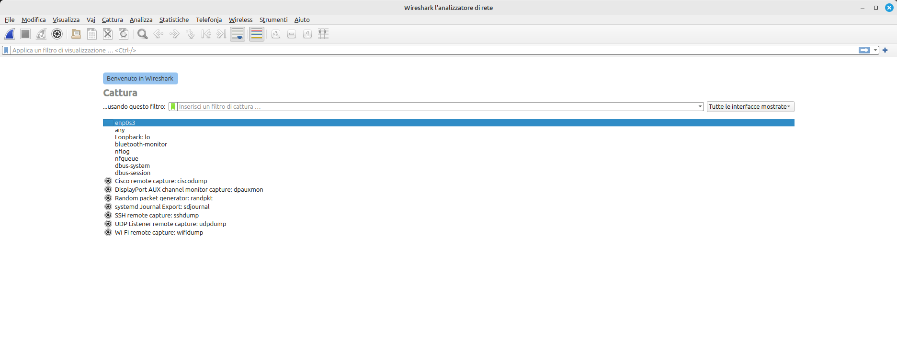

# Analisi del traffico di rete 
In questo laboratorio useremo alcuni strumenti per l'analisi della configurazione del interfacce di rete e del traffico di rete che le attraversa. Useremo questi strumenti per catturare traffico di rete dalle interfacce della macchina virtuale e per analizzare le tracce di traffico contenenti alcuni attacchi di tipo Distributed Denial of Service (DDoS).

## ifconfig
L’utilità ifconfig viene utilizzata per assegnare un indirizzo IP a un’interfaccia di rete, e per configurare/vedere i parametri dell’interfaccia di rete. 
Da linea di comando esegui:
```
ifconfig
```

## netstat
Il comando netstat visualizza il contenuto di varie strutture dati relative alla rete. Esistono diversi formati di output, a seconda delle opzioni per le informazioni presentate. La prima forma del comando mostra un elenco delle connessioni attive per ogni protocollo. Da linea di comando esegui:
```
netstat -lna
```

## tcpdump
Tcpdump stampa una descrizione del contenuto dei pacchetti su un’interfaccia di rete; Può anche essere eseguito con l'opzione ```-w```, che gli consente di salvare i dati dei pacchetti in un file per un’analisi successiva, 
e/o con l'opzione ```-r```, che gli permette di leggere da un file di pacchetti (pcap) salvato invece di leggere i pacchetti da un’interfaccia di rete. Da linea di comando esegui:
```
sudo tcpdump -i enp0s3 -n
```
Dove ```enp0s3``` e' l'interfaccia di rete che vogliamo monitorare (cioe', della quale vogliamo vedere il traffico di rete che l'attraversa), mentre ```sudo``` e' un comando che permette di eseguire delle istruzioni con i permessi di amministratore. Senza di esso, il sistema operativo Linux non permette di catturare il traffico di rete che attraversa un'interfaccia per motivi di sicurezza.

Per aprire una traccia di rete catturata in precedenza, dalla cartella ```cybersecurity-highschool-2025``` esegui:
```
tcpdump -r Dataset/syn-chunk.pcap
```
In questo caso non servono i permessi di amministratore.


## Wireshark

Un modo piu' immediato per ispezionare e analizzare la struttura dei pacchetti di rete è utilizzare l’applicazione open-source ben nota chiamata Wireshark (https://www.wireshark.org/).
Wireshark offre le stesse funzionalita' di ```tcpdump``` con la comodita' di un'interfaccia grafica.

Da linea di comando esegui:
```
sudo wireshark
```
|   |
|--|

Se ottieni un errore del tipo ```File o directory non esistente```, significa che il software non e' installato nel sistema. Per installarlo, esegui:
```
sudo apt install wireshark
```

Per catturare del traffico dall'interfaccia di rete ```enp0s3```, assicurati che l'interfaccia sia selezionata come mostrato nella figura sopra, e premi il pulsante a forma di pinna di squalo in alto a sinistra.
Avvia anche ```firefox``` per generare un po' di traffico web. I pacchetti di questo traffico verranno catturati e mostrati nella finestra di ```wireshark```.

|   |
|--|

Per aprire e visualizzare una traccia di traffico, andare nel menu ```file->Apri```, e scegliere uno dei files ```pcap``` nella cartella ```Dataset``` all'interno della cartella ```cybersecurity-highschool-2025```.