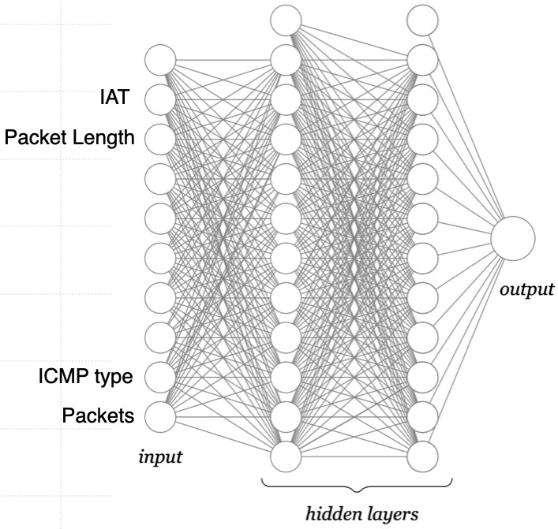

# Multi-Layer Perceptron (MLP)
In questa serie di laboratori, addestriamo dei modelli MLP per la classificazione binaria di dati:

1. Iniziamo con un dataset sintetico (quindi non dati reali, ma dati creati appositamente per gli esperimenti). In questo dataset. i campioni sono rappresentati con 2 features per poter essere rappresentati graficamente. 
In questo primo laboratorio [MLPTwoFeatures](./MLPTwoFeatures.ipynb), addestriamo un modello MLP per trovare un confine decisionale tra due classi NON linearmente separabili.
Abbiamo provato ad eseguire lo stesso task con Logistic Regression (laboratorio [Logistic Regression](../05-LogisticRegression/)). Ma per riuscirci abbiamo dovuto ricorrere a features polinomiali.
Il vantaggio delle reti neurali come MLP e' che possono risolvere problemi complessi richiedendo una preparazione meno laboriosa dei dati.

2. Nel notebook [MLPDDoS](./MLPDDoS.ipynb) utilizzeremo una rete neurale MLP per classificare i flussi di traffico di rete come benigni o dannosi. Il modello di MLP restituisce un valore compreso tra 0 e 1, che rappresenta la probabilità che il flusso in ingresso sia malevolo. Usiamo una soglia fissata a 0,5 per determinare se il flusso di rete è dannoso o meno.
Addestreremo un modello di Logistic Regression con traffico di rete benigno e quattro classi di attacchi DDoS dal dataset CIC-DDoS2019 dell’Università del New Brunswick. Il traffico di rete è stato precedentemente pre-elaborato in modo che i pacchetti siano raggruppati in flussi di traffico bidirezionali utilizzando la 5-tupla (IP sorgente, IP destinazione, porta sorgente, porta destinazione, protocollo). Ogni flusso è rappresentato da 21 features (attributi) dell’header dei pacchetti calcolate da un massimo di 1000 pacchetti:

| Features           | Multi-Layer Perceptron          |
|---------------------|--------------------|
| timestamp (mean IAT)    packet_length (mean)   IP_flags_df (sum)   IP_flags_mf (sum)   IP_flags_rb (sum)   IP_frag_off (sum)   protocols (mean)   TCP_length (mean)   TCP_flags_ack (sum)   TCP_flags_cwr (sum)   TCP_flags_ece (sum)   TCP_flags_fin (sum)   TCP_flags_push (sum)   TCP_flags_res (sum)   TCP_flags_reset (sum)   TCP_flags_syn (sum)   TCP_flags_urg (sum)   TCP_window_size (mean)   UDP_length (mean)   ICMP_type (mean)   Packets (counter)  |   |
