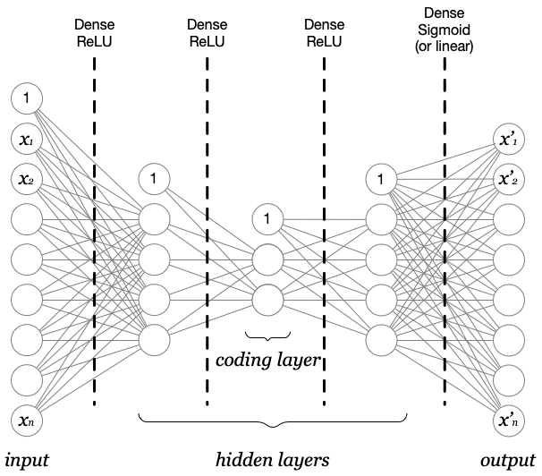

# Autoencoders
In questo laboratorio, implementiamo un Autoencoder per la rilevazione di anomalie di rete.
Oltre all'implementazione, cercheremo di trovare il numero ottimale di neuroni nei vari layers delle rete neurale (```coding layer``` incluso) per massimizzare il numero di anomalie rilevate e minimizzare i falsi allarmi.

|   |
|--|
| Architettura dell'Autoencoder|