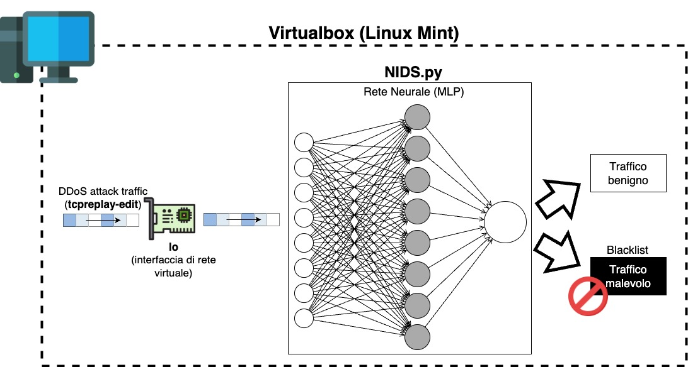

# Analisi del traffico di rete con Deep Learning
In questo laboratorio, useremo un modello Multi-Layer Perceptron (MLP) precedentemente addestrato per analizzare il traffico di rete e riconoscere eventuali attacchi.
Per eseguire il laboratorio, vanno aperti due terminali. In uno eseguiamo il network intrusion detection system, nell'altro simuliamo un attacco di rete.

## Terminale 1
Far partire il network intrusion detection system con il seguente comando:
```python NIDS-lab.py --predict_live lo --model ../06-DeepLearning/mlp_model.h5 --dataset_type DOS2019```

Questo comando avvia uno script Python che carica il modello MLP generato nel precedente laboratorio e che raccoglie il traffico che attraversa l'interfaccia di rete ```lo```. 

## Terminale 2
Sul secondo terminale simuliamo un attacco di rete trasmettendo una traccia di traffico pre-registrata attraverso l'interfaccia ```lo```. La stessa su cui il network intrusion detection system e' in ascolto.

```sudo tcpreplay-edit -i lo ../Dataset/ddos-chunk.pcap```

La figura sottostate fornisce una rappresentazione dell'esperimento.


